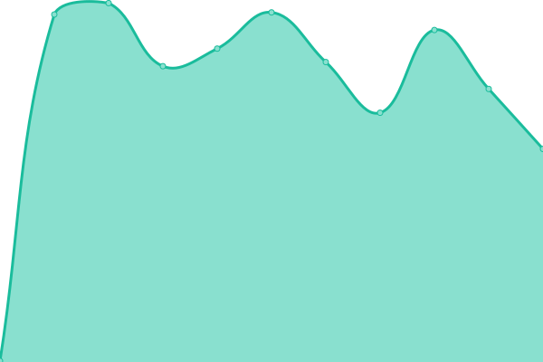
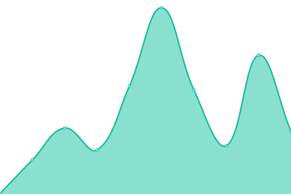

# [📈 Live Status](https://status.isar-labs.com): <!--live status--> **🟧 Partial outage**

This repository contains the open-source uptime monitor and status page for [Isar Labs](https://isar-labs.com), powered by [Upptime](https://github.com/upptime/upptime).

With [Upptime](https://upptime.js.org), you can get your own unlimited and free uptime monitor and status page, powered entirely by a GitHub repository. We use [Issues](https://github.com/isar-labs/status/issues) as incident reports, [Actions](https://github.com/isar-labs/status/actions) as uptime monitors, and [Pages](https://status.isar-labs.com) for the status page.

<!--start: status pages-->
<!-- This summary is generated by Upptime (https://github.com/upptime/upptime) -->
<!-- Do not edit this manually, your changes will be overwritten -->
<!-- prettier-ignore -->
| URL | Status | History | Response Time | Uptime |
| --- | ------ | ------- | ------------- | ------ |
|  [Suite](https://suite.isar-labs.com) | Aktiv | [suite.yml](https://github.com/Isar-Labs/status/commits/HEAD/history/suite.yml) | 

 1337ms
     
 | 

<a href="https://status.isar-labs.com/history/suite">100.00%</a>
    

|  [Construction Documentation](https://construction-documentation.isar-labs.com) | Aktiv | [construction-documentation.yml](https://github.com/Isar-Labs/status/commits/HEAD/history/construction-documentation.yml) | 

 782ms
     
 | 

<a href="https://status.isar-labs.com/history/construction-documentation">100.00%</a>
    

|  [Document Workflow](https://document-workflow.isar-labs.com) | Aktiv | [document-workflow.yml](https://github.com/Isar-Labs/status/commits/HEAD/history/document-workflow.yml) | 

 837ms
     
 | 

<a href="https://status.isar-labs.com/history/document-workflow">100.00%</a>
    

|  [Vercel CDN & Serverless (third party)](https://www.vercel-status.com/api/v2/summary.json) | Aktiv | [vercel-cdn-and-serverless-third-party.yml](https://github.com/Isar-Labs/status/commits/HEAD/history/vercel-cdn-and-serverless-third-party.yml) | 

 306ms
     
 | 

<a href="https://status.isar-labs.com/history/vercel-cdn-and-serverless-third-party">97.83%</a>
    

|  [Trigger.dev (third party)](https://status.trigger.dev) | Aktiv | [trigger-dev-third-party.yml](https://github.com/Isar-Labs/status/commits/HEAD/history/trigger-dev-third-party.yml) | 

 1106ms
     
 | 

<a href="https://status.isar-labs.com/history/trigger-dev-third-party">99.59%</a>
    

|  [Cloudflare (third party)](https://www.cloudflarestatus.com/api/v2/summary.json) | Inaktiv | [cloudflare-third-party.yml](https://github.com/Isar-Labs/status/commits/HEAD/history/cloudflare-third-party.yml) | 

 205ms
     
 | 

<a href="https://status.isar-labs.com/history/cloudflare-third-party">0.00%</a>
    

|  [Neon DB (third party)](https://neonstatus.com) | Aktiv | [neon-db-third-party.yml](https://github.com/Isar-Labs/status/commits/HEAD/history/neon-db-third-party.yml) | 

 245ms
     
 | 

<a href="https://status.isar-labs.com/history/neon-db-third-party">99.13%</a>
    

<!--end: status pages-->

[**Visit our status website →**](https://status.isar-labs.com)

## 📄 License

- Powered by: [Upptime](https://github.com/upptime/upptime)
- Code: [MIT](./LICENSE) © [Anand Chowdhary](https://anandchowdhary.com), supported by [Pabio](https://pabio.com)
- Data in the `./history` directory: [Open Database License](https://opendatacommons.org/licenses/odbl/1-0/)
